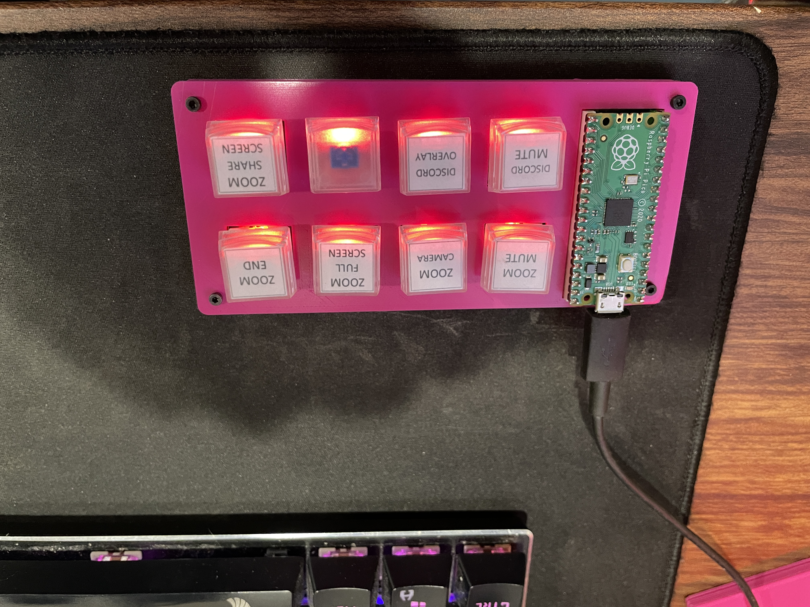
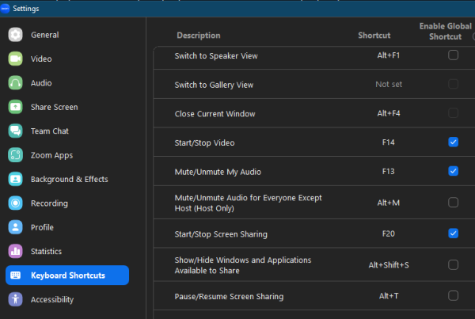

# CheapStreamKeyboard

A macro keyboard using a Raspberry Pi Pico board.

    Cheap Stream Keybaord - Macro Keyboard
    Author: DadZilla
    Version: 0.1
    

## How It Works:
The keyboard works by emulating extended function keys F13 - F20.  By themselves the keys do nothing until bound within an application.  For example, if you wanted to use the keys to control functions while on a Zoom call, you can set Keyboard Shortcuts in Zoom.

The same thing can be done in applications like Discord or games to record a keybind to these new function keys.

## Hardware:
1. Raspberry Pi Pico board.
2. Custom Printed Circuit Board Version 1.0 (Link to easyeda)
	
3. 8 Cherry MX Style switches
4. 8 surface mount LEDs (size 1206) along with 8 appropriatly sized surface mount resistors (size 0603).
5. 3D printed case.

## Library Requirements:
1. adafruit circuitpython (included)
2. adafruit_hid (included)
3. adafruit_debouncer (included)
4. adafruit_ticks (included)
5. dadzilla_button (included)

## Setup:
1. Install Adafruit Circuitpython
	- while pressing the BOOTSEL button on the Raspberry PI Pico, plug in the USB cable connected to your PC, then release the button.
		- this should open the device as a removable storage device with a name like 'CIRCUITPY'.
	- delete existing files on the removable storage device.
	- copy the 'adafruit-circuitpython-raspberry_pi_pico-en_US-7.3.3.uf2' file from the source code folder 'Adafruit Circuitpython' to the raspberry pi pico.  
		- this will flash it and should reboot.
2. now open the 'CheapStreamKeyboardCode' folder from the source code and copy all files and paste onto the raspberry pi pico.  it should look like this (ignore the files you didn't copy as those are system generated files): 
3. Unplug the USB cable from the keybaord, then plug it in again to reboot with the new code and all the LEDs on the keyboard should be on.	If working properly the LED for the key pressed will increase in brightness.
